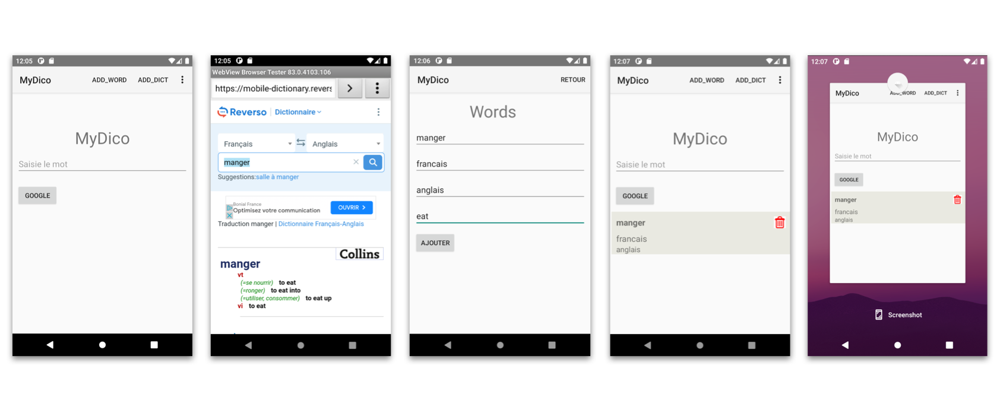
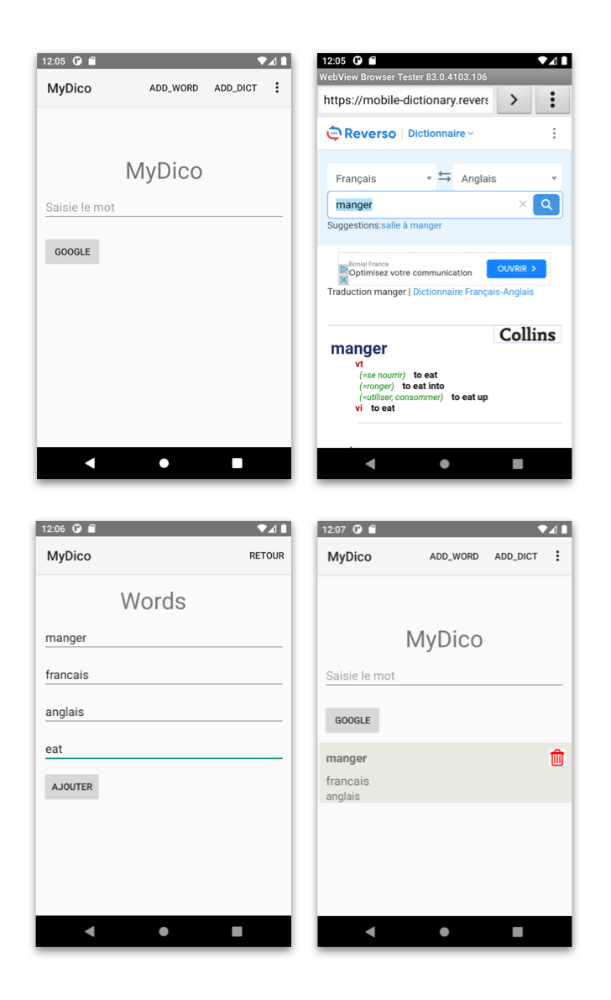

<h3 align="center">Word Dictionary</h3>

<!-- ABOUT THE PROJECT -->
## About The Project

Word Dictionary is a mobile application designed to facilitate language learning
by allowing users to save words from translation websites. The app serves as a 
personalized dictionary, enabling users to curate a collection of words they want to learn.
Here's how the app works:
- Word Collection:
    Users can input words manually or, more conveniently, save them directly from translation
    websites. The app seamlessly integrates with popular translation sites to extract and store
    selected words. 
- Notification System :
    The app employs a notification system to prompt users with a selection of saved words at scheduled
    intervals. These notifications serve as gentle reminders for users to focus on learning a few
    words at a time.

(<a href="#readme-top">back to top</a>)

### Built With

* [![Kotlin][Kotlin.com]][Kotlin-url]
* [![Android][Android.com]][Android-url]

<!-- USAGE EXAMPLES -->
## Usage

<!-- CONTACT -->
## Contact

Reda Meziane - reda.meziane99@gmail.com

Project Link: [https://github.com/WordDictionary](https://github.com/RedaMez/WordDictionary)

(<a href="#readme-top">back to top</a>)

<!-- MARKDOWN LINKS & IMAGES -->
<!-- https://www.markdownguide.org/basic-syntax/#reference-style-links -->
[Kotlin.com]: https://img.shields.io/badge/kotlin-7F52FF?style=for-the-badge&logo=kotlin&logoColor=white
[Kotlin-url]: https://kotlinlang.org
[Android.com]: https://img.shields.io/badge/android-34A853?style=for-the-badge&logo=android&logoColor=white
[Android-url]: https://android.com

